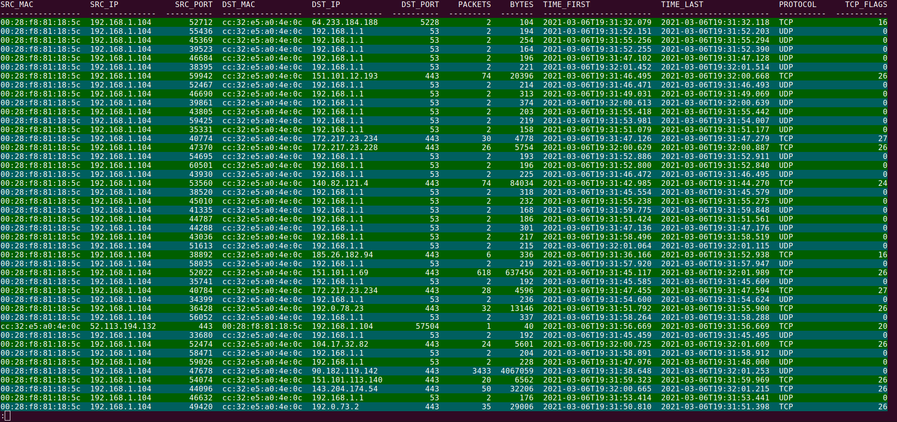

# NEMEASHARK

## Installation

Installation nemeashark is simple.

1. Clone repository
2. Run: make prepare-dev
3. Use nemeashark

## Usage

I recomand you to use nemeashark with `| less -RS` , R parameter will allows colors and -S will allows less command to extend output outside the screen (use keyboard arrows to read overflow output).

**Supported plugins:** basic, basicplus, http

### Parameters

- `-p --plugin <plugin> [<plugin> ...]` Plugins setted in ipfixprobe of nemea system.
- `-m --mark <type:value> [<type:value> ...]` Mark some specific value. Example 1: ip:192.168.0.1 will mark every ip addres 192.168.0.1 with RED. Posible types: ip|mac|port|packets|bytes
- `-f --filter <type:value>` Filter some specific flow. Example 1: 'ip:192.168.0.1&&port:53' will filer every flow where is ip addres 192.168.0.1 and port 53 in same flow. Can be use locical OR (||) and AND (&&) and brackets (), but when OR is placed you must filter wrap in quotations marks. Posible types: ip|mac|port|packets|bytes. There are also slecial filters: ipv4|ipv6|broadcast
- `-n <number>` Number of flows that will be showed with one header. Default value is 46 lines, that is approximately one less command page.
- `-s --sort <criterion>` Sort n flow (from parameter -n, recomanded usage with -n 0) by criterion. Posible criterions are ip|mac|port|packets|bytes.

**Common TRAP parameters**

- `-h [trap,1]` Print help message for this module / for libtrap specific parameters.
- `-i IFC_SPEC` Specification of interface types and their parameters (mandatory).
- `-v` Be verbose.
- `-vv` Be more verbose.
- `-vvv` Be even more verbose.

### Example run

`$ nemeashark -i u:basic | less -RS`

### Filtering

### Marking

### Sorting

In development...
